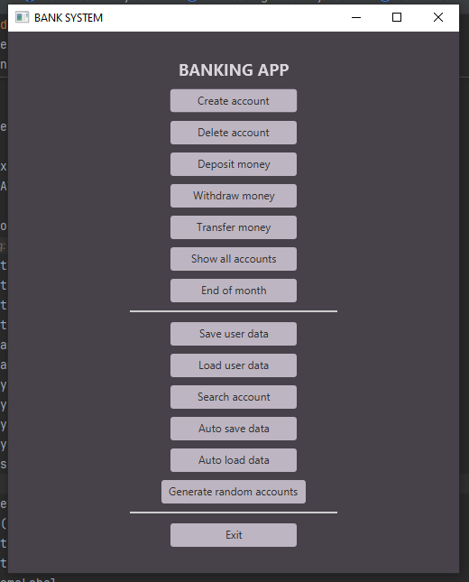
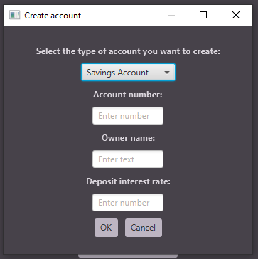

# Bank System JavaFX

Bank System JavaFX is a beginner-friendly desktop banking application built with Java and JavaFX.

The project simulates a small banking system where users can create accounts, manage balances, transfer money, and store account data between sessions. It was created as a learning project to practice object-oriented programming, graphical user interface development, and file handling in Java.

## Features

- Create savings accounts
- Create credit accounts
- Delete accounts
- Search accounts by account number
- Deposit money
- Withdraw money
- Transfer money between accounts
- Display all accounts
- Apply end-of-month account updates
- Save account data to a file
- Load account data from a file
- Generate random accounts

  
  

  Main Window | Create Account

## Technologies Used

- Java 17
- JavaFX
- Maven
- Object-Oriented Programming (OOP)
- File Serialization (`ObjectOutputStream` / `ObjectInputStream`)

## Project Structure

- `BankApp` - JavaFX user interface
- `BankService` - business logic and account management
- `BankAccounts` - base account model
- `BankSavingAccount` - savings account implementation
- `BankCreditAccount` - credit account implementation

## Learning Goals

This project helped me practice:

- building desktop interfaces with JavaFX
- working with buttons, text fields, dialogs, and layouts
- using inheritance and polymorphism
- managing collections with `ArrayList`
- implementing account operations such as deposit, withdrawal, and transfer
- saving and loading objects from files
- separating user interface code from application logic

## How to Run

1. Make sure Java 17 is installed
2. Open the project in IntelliJ IDEA
3. Reload the Maven project if needed
4. Run the `BankApp` class

## Project Purpose

This project was created for learning purposes and reflects my progress as a beginner Java developer. The goal was not only to make the application work, but also to better understand how Java, JavaFX, and object-oriented design work together.

## Future Improvements

- Improve the graphical interface
- Add account history
- Display accounts in a table
- Add better validation and error handling
- Refactor repeated UI code